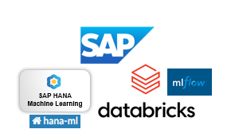

## This folder provides sample code to for using [hana-ml](https://pypi.org/project/hana-ml/) with[ Databricks managed mlflow](https://docs.databricks.com/aws/en/mlflow/#databricks-managed-mlflow)
This is supporting code for the workflow described in the blogpost [developing-hana-ml-models-with-sap-databricks](https://community.sap.com/t5/technology-blog-posts-by-sap/developing-hana-ml-models-with-sap-databricks/ba-p/14317905).

### The code contains notebooks for training and serving the model
### Prerequisites:
HANA Cloud database with the following privileges 
- AFL__SYS_AFL_AFLPAL_EXECUTE_WITH_GRANT_OPTION
- AFL__SYS_AFL_APL_AREA_EXECUTE
- AFLPM_CREATOR_ERASER_EXECUTE

HANA Cloud database user credentials : url,port,user,password.
These are setup as secrets and used as environment variables in the code for both training and serving.
The training and serving credentials can be different if the user wants to train the data on one HANA Cloud on one instance and have the inference data on a different HANA Cloud instance.
